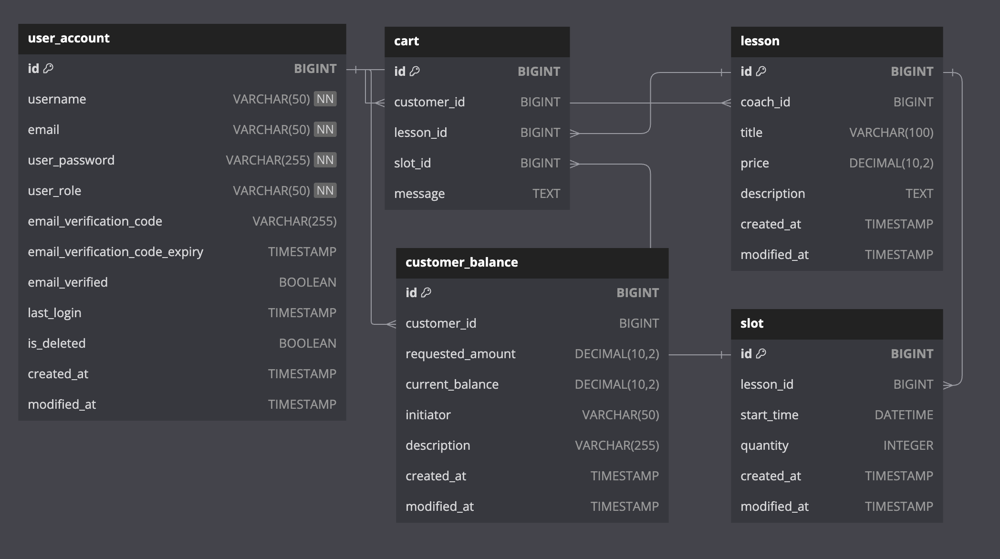

# 🍯 LearnHive - 레슨 중개 서비스 플랫폼
전문 코치들이 제공하는 다양한 분야의 수업을 한곳에서 찾아 예약할 수 있는 레슨 중계 플랫폼입니다.

## 프로젝트 기능

#### 1. 회원 기능

- 회원 가입
    - 회원 계정은 `코치` 혹은 `고객` 역할 중 하나로 설정한다.
        - **코치 (Coach):** 1:1 PT 프로그램을 제공하는 코치를 나타낸다. 코치 정보를 저장하며, 수업 (Lesson)을 등록, 수정, 삭제하는 권한을 가진다.
        - **고객 (Customer)** :수업을 신청하는 고객을 나타낸다. 고객의 정보를 저장하며, 수업을 예약하는 권한을 가진다.
    - 회원 가입 시 이름, 이메일, 비밀번호를 입력한다.
        - 이름과 이메일은 기존 회원과 중복되지 않는다.
        - 이메일은 이메일 주소 포맷에 맞게 입력한다.
          - 이메일 주소가 올바른지 인증하기 위해 별도의 이메일 인증 절차를 진행한다.
          - 회원 가입시 이메일로 전송된 인증 링크를 통해 본인의 이메일을 인증할 수 있다.
          - 이메일 인증 요청은 30분 이후에 만료되며 새로운 인증 링크 요청이 가능하다.
        - 비밀번호는 8자 이상 32자 이하이며 대소문자, 숫자, 특수문자를 포함한다.
- 회원 정보 수정
    - 회원은 로그인 후 자신의 회원 정보를 수정한다.
    - 사용자 이름, 비밀번호, 이메일만 수정할 수 있다.
    - 계정 역할은 초기에 설정 후 변경이 불가하다.
    - 새로 입력한 정보가 회원 가입시 주어진 조건과 맞을 때 기존 정보를 수정할 수 있다.
- 회원 탈퇴
    - 회원은 로그인 후 자신의 계정을 삭제한다.
- 로그인
    - 회원은 가입을 완료한 계정의 이름과 비밀번호를 사용해서 로그인한다.
    - 가입 정보와 입력한 정보가 일치하지 않으면 로그인할 수 없다.
- 로그아웃
    - 회원은 로그인 후 자신의 계정을 로그아웃한다.
    - 동일한 계정으로 로그인된 기기를 모두 로그아웃할 수 있다.

#### 2. 상품 관리 기능

- 상품 등록, 수정 삭제
    - 코치는 로그인 후 수업을 등록, 수정, 삭제한다.
    - 모든 수업은 하나 이상의 슬롯을 갖는다.
    - 수업명은 다른 수업명과 중복되지 않는다.
    - 슬롯은 해당 수업을 신청할 수 있는 시간 정보를 나타낸다.
    - 슬롯명은 해당 수업의 다른 슬롯명과 중복되지 않는다.

#### 3. 상품 검색 기능

- 상품명 검색
    - 모든 사용자는 로그인 여부와 관계없이 수업명을 검색한다.
- 상품 상세 조회
    - 모든 사용자는 로그인 여부와 관계없이 수업명, 가격, 선택 가능한 슬롯을 조회한다.

#### 4. 장바구니 기능

- 장바구니 상품 추가, 조회, 수정, 삭제
    - 고객은 로그인 후 원하는 수업을 장바구니에 추가하거나 장바구니에서 삭제한다.
    - 장바구니에 동일한 수업의 슬롯은 중복으로 추가할 수 없다.
      장바구니에 담긴 레슨이나 슬롯의 변동 사항을 추적하기 위해 메시지를 일시적으로 저장하며, 장바구니 내역이 갱신될 때 내용이 전달된다.
  
#### 5. 상품 주문 기능

- 고객은 로그인 후 장바구니에 추가한 수업을 결제한다.
- 주문 금액은 로그인한 계정의 예치금으로 결제한다.
- 수업 시작 하루 전까지 주문을 취소할 수 있다.

## 사용 기술

- Java 17
- Spring Boot 3.3.4
- JPA
- MySQL
- Redis
- Docker
- Git

## ERD

